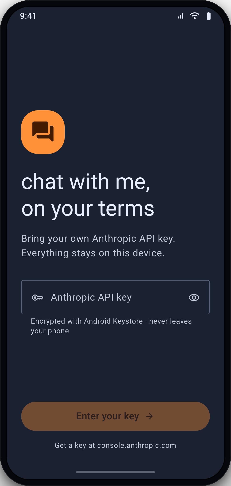
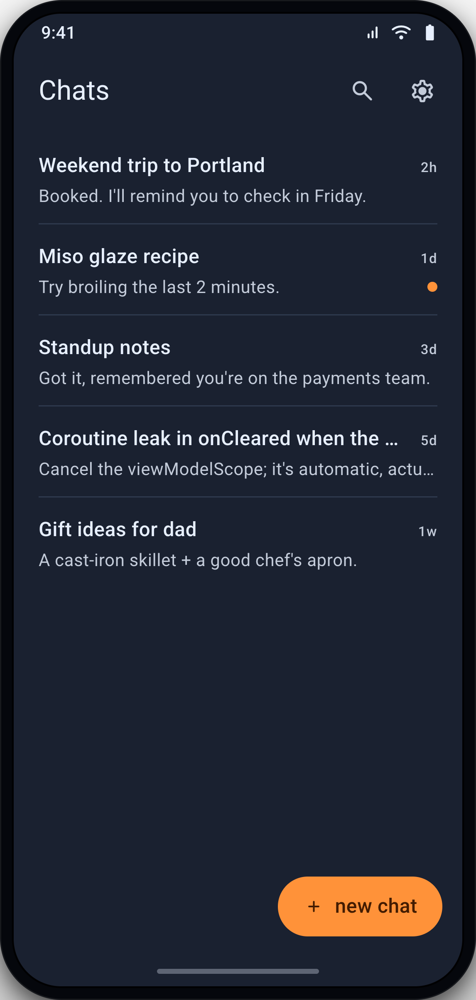
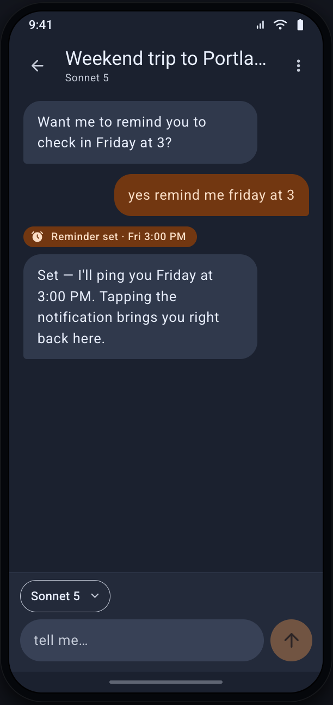
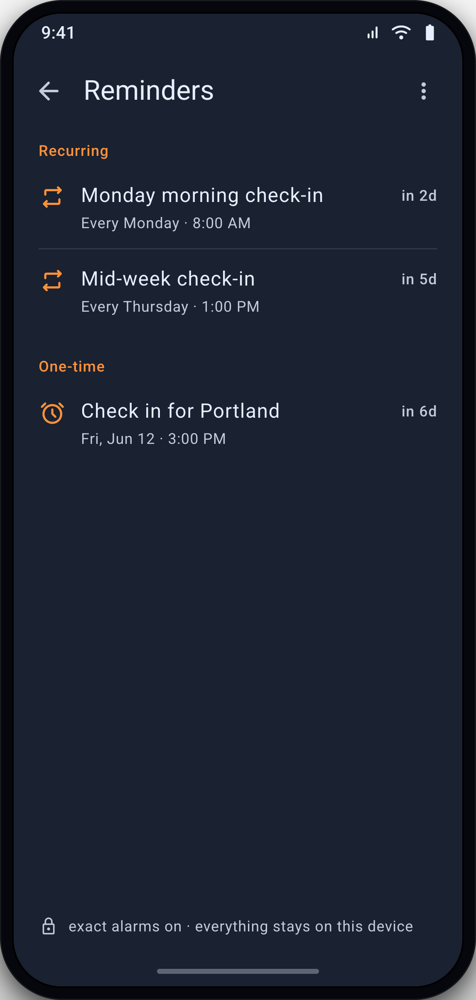
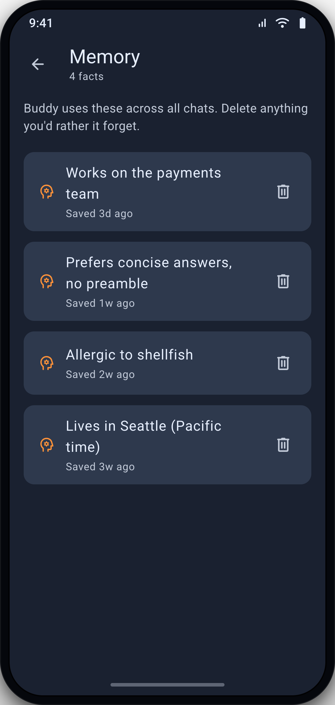
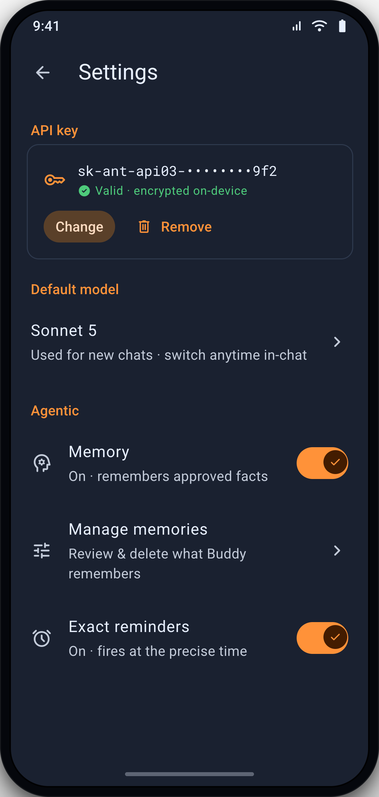

# Chatbot
> **Work in progress.** Not yet ready for use.

A native Android chatbot powered by Claude, using your own Anthropic API key.

## Product

You pick the Claude model per chat.

As a local-first app, everything stays on your device.

Beyond answering, the assistant acts on your behalf within a chat:

- **Proactive reminders**: ask it to remind you of something, *"Check in with me on Monday mornings about my weekly goals"*. No other chatbot offers this feature so far.
- **Memory**: it remembers facts you approve across chats, shaping later ones. You can review and delete them anytime.

No backend server and no project-owned key: chats, reminders, memories and the key all live on-device.

| Onboarding |                         Chat list                         |                         Chat details                         |
|:-:|:---------------------------------------------------------:|:----------------------------------------------------:|
|  |  |  |
| **Reminders** |                        **Memory**                         |                     **Settings**                     |
|  |             |      |

## Tech stack
The purpose of this project is to try out the latest Android tech stack.

| Area          | Choice                                    |
|---------------|-------------------------------------------|
| Language      | Kotlin 2.4                                |
| SDK           | targetSdk 37, minSdk 31                   |
| UI            | Jetpack Compose, Material 3               |
| Navigation    | Jetpack Navigation 3 with adaptive scenes |
| Multiplatform | KMP-first: Android target now, iOS later  |
| DI            | Hilt                                      |
| Async         | Coroutines                                |
| Storage       | Room, DataStore                           |
| Encryption    | Android Keystore, Tink                    |
| AI engine     | Ktor client, Anthropic Messages API       |
| Background    | AlarmManager, WorkManager                 |
| Formatting    | Spotless + ktlint                         |

## Architecture

Google's official guidance, feature-modularized.

```
:app  →  :feature  →  :core
              ↓
           :shared            (KMP: data + domain)
```

- **Layers:** UI → optional domain → data, dependencies point one way only.
- **Local-first:** Room DB is the single source of truth.
- **Unidirectional data flow:** MVVM. State travels one way, and events travel the other.

Module map, layer diagrams and data flow: [docs/architecture.md](docs/architecture.md).

## Testing

**TDD is mandatory:** red → green → refactor, every step. No mocking libraries; fakes and real objects only.

| Kind                                               | Where | Tools                                |
|----------------------------------------------------|---|--------------------------------------|
| Unit                                               | `commonTest`, module `test/` | JUnit4, coroutines-test              |
| Integration | `androidHostTest` | Room in-memory, Robolectric          |
| Compose UI                 | module `test/` | Compose testing APIs v2, Robolectric |
| Screenshot                                         | `screenshotTest/` | Compose Preview Screenshot Testing   |
| Acceptance / E2E                                   | `journeys/*.xml` | Android Journeys                     |

## Workflow

Spec-driven and agent-native. Nothing is coded before it is specified.

- **Specs are the source of truth.** Numbered specs in `specs/` describe the current system.
- **Pipeline:** brainstorm → spec → plan → TDD implementation.
- **Skills over prompts.** Recurring rules live in `.claude/skills/` as versioned project skills (`architecture`, `design-system`, plus Google's official Android skills) and in `CLAUDE.md`, so the agent reads them instead of being told each time.
- **Design system:** every screen renders through `:core:ui`. Dark-first Material 3 theme, typed tokens, and a reusable component catalog.

