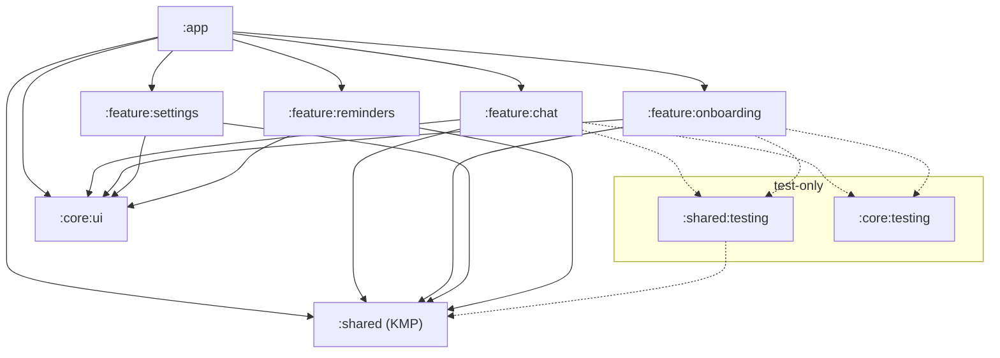
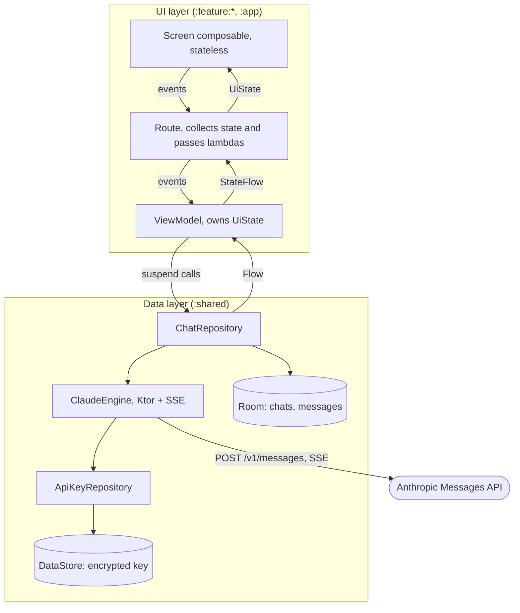
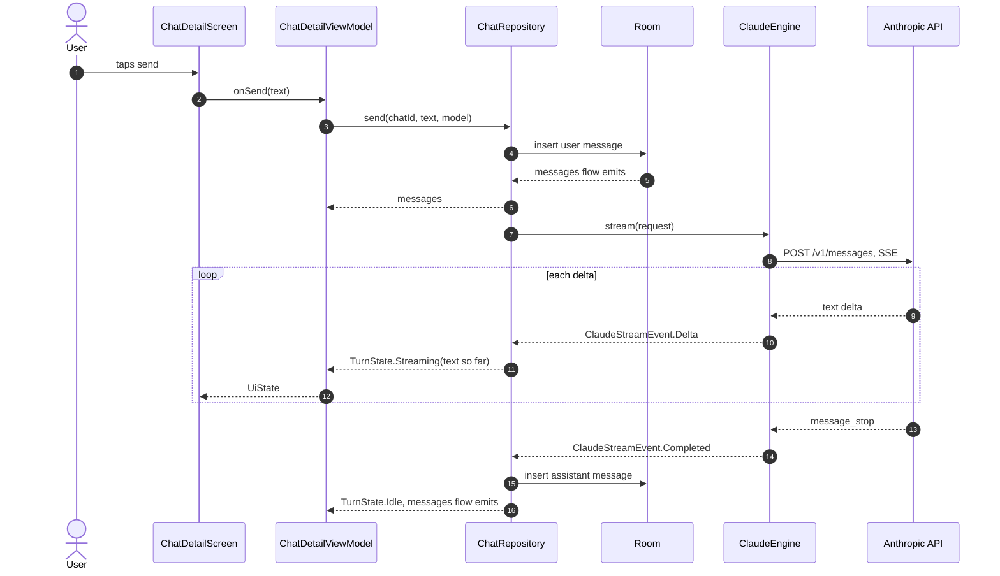
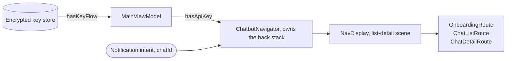

# Architecture

An overview of how the app is put together: what the modules are, what each one holds, and how
data and events move between them. Conventions and their rationale live in the `architecture`
project skill; specs in `specs/` describe individual features.

The app is offline-first and has no backend: chats and the user's API key live on the device, and
the only remote call is that key going straight to the Anthropic API.

## Modules

| Module | Holds                                                                                                                                                                                                                                                                                              |
|---|----------------------------------------------------------------------------------------------------------------------------------------------------------------------------------------------------------------------------------------------------------------------------------------------------|
| `:shared` (KMP) | The whole data layer and the models every other module speaks in: `claude` (Ktor client, SSE parsing, `ClaudeEngine`), `chat` (`ChatRepository`, Room entities, DAOs), `apikey` (encrypted key store), `database`, `model`, and the root types all sides share (`ApiError`, `ContentBlock`, `Role`) |
| `:core:ui` | Design System tokens and components, Themes, generic strings. Depends on nothing in the project                                                                                                                                                                                                    |
| `:feature:chat` | Chat list and chat detail: ViewModels, screens, streaming UI, model picker                                                                                                                                                                                                                         |
| `:feature:onboarding` | First-launch API key entry and validation                                                                                                                                                                                                                                                          |
| `:feature:settings`, `:feature:reminders` | Placeholder screens, not yet in the navigation graph                                                                                                                                                                                                                                               |
| `:app` | `MainActivity`, Navigation graph and logic, Hilt modules                                                                                                                                                                                                      |
| `:shared:testing`, `:core:testing` | Fakes and helpers other modules' tests reuse, never a production dependency                                                                                                                                                                                                                        |

Hard rules:

- A feature never depends on another feature. Cross-feature navigation goes through the `:app` graph.
- `:shared` depends on nothing in the project, and its `commonMain` never imports `android.*`.
- Hilt stays out of `:shared`. Shared classes take constructor parameters, and Hilt modules in
  `:app`.

## Layers

Two layers, plus a domain layer of use cases the project does not currently need. Dependencies
point one way.

- **Unidirectional data flow (UDF):** State travels one way, from the repository through the ViewModel
  to the screen, and events travel the other, from the screen back to the repository. A screen
  receives one immutable `UiState` and emits lambdas. Every outcome, errors and one-shot results
  included, is folded into that state, so nothing is pushed from a ViewModel to the UI through an
  event channel. Compose says the same thing as "state down, events up", where down means toward
  the leaf composables rather than toward the data layer.
- **Repositories are the sole entry to the data layer.** No ViewModel touches a DAO, DataStore, or
  the Ktor client.
- **Offline-first: Room is the single source of truth (SSOT)** for everything persisted, and with no server to sync against
  there is no remote source and no conflict resolution. The one exception is the reply currently
  streaming, which lives in memory as `TurnState` and is written once when the stream ends, never
  per token.
- Data crossing a layer boundary is immutable, and mutation happens only inside the owner.

## Sending a message

The turn runs on the repository's own scope, so it survives the screen going away and finishes
into the database either way. A failure takes the same path as `TurnState.Failed` carrying a typed
`ApiError`, which the feature maps to copy it owns.

## Navigation and the API key gate

`MainViewModel` reads whether a key is stored, never the key itself, and the splash screen is held
until that resolves. The answer seeds the Navigation 3 back stack on its first composition, so the
app opens on onboarding or on the chat list without being rewritten onto it.

`ChatbotNavigator` is the only thing that mutates the back stack, so features receive lambdas and
know nothing about navigation. One graph plus the list-detail scene strategy gives a phone a stack
of screens and a wide window two panes, from the same keys.
